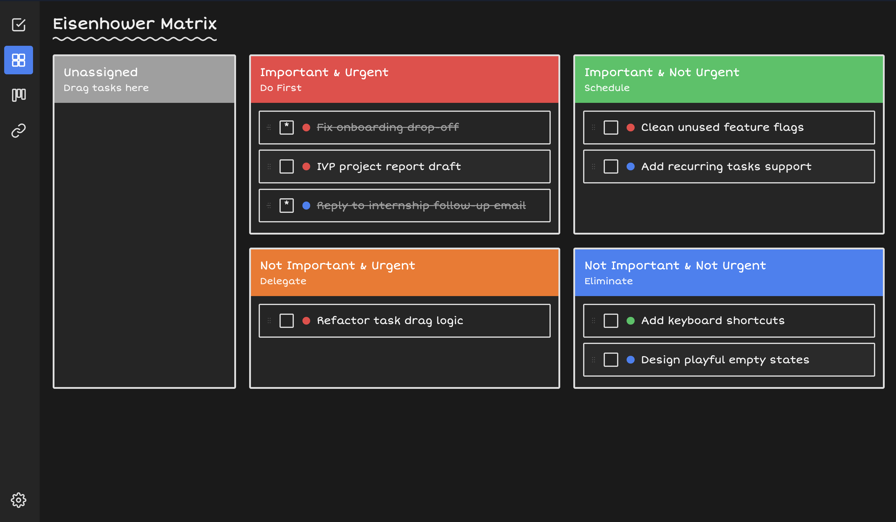

  

## What is NoteGrid?

NoteGrid is a FOSS cross-platform app that helps you manage your todos and links. It contains:

- **Eisenhower Matrix** - Sort tasks by urgency and importance
- **Kanban Board** - Track task progress through stages of completion
- **Bookmarks manager** - Save links for later reference

All your data syncs automatically across devices.

## No Account Required

NoteGrid uses a unique UUID generated on registering instead of username/password. Store it somewhere safe as it is the only way to access your data

## Motivation

I wanted a simple productivity app that works cross platform without the bloat or limitations of basic todo apps

Most productivity apps are either:
- Paid or sell your data to third party
- Force you into their specific workflow
- Are overcomplicated with features

NoteGrid is different: it's simple, no login, works everywhere and completely free, no questions asked :)

## Download

### Web

Visit [notegrid.pages.dev](https://notegrid.pages.dev)

### Android

1. Download the APK from the [Releases](https://github.com/Try3D/notegrid/releases) page
2. Open the APK on your device
3. If prompted, enable "Install from unknown sources" in Settings
4. Install and open the app

### Chrome Extension

1. Download the `.crx` file from the [Releases](https://github.com/Try3D/notegrid/releases) page
2. Open `chrome://extensions` in Chrome
3. Enable "Developer mode" (toggle in top right)
4. Drag and drop the `.crx` file onto the page, or:
   - Click "Load unpacked"
   - Select the extracted extension folder

### iOS

Ew apple

## Tech Stack

| Component | Technology |
|-----------|------------|
| Web | React + Vite + Jotai |
| Mobile/Desktop | Flutter |
| Browser Extension | Chrome Extension (Manifest V3) |
| Backend | Hono on Cloudflare Workers |
| Database | Cloudflare R1 |

## Screenshots

### Web

  
  

### Mobile

  
  
  
  

### Chrome Extension

  

